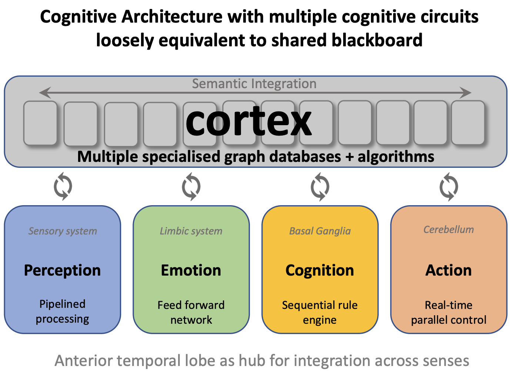
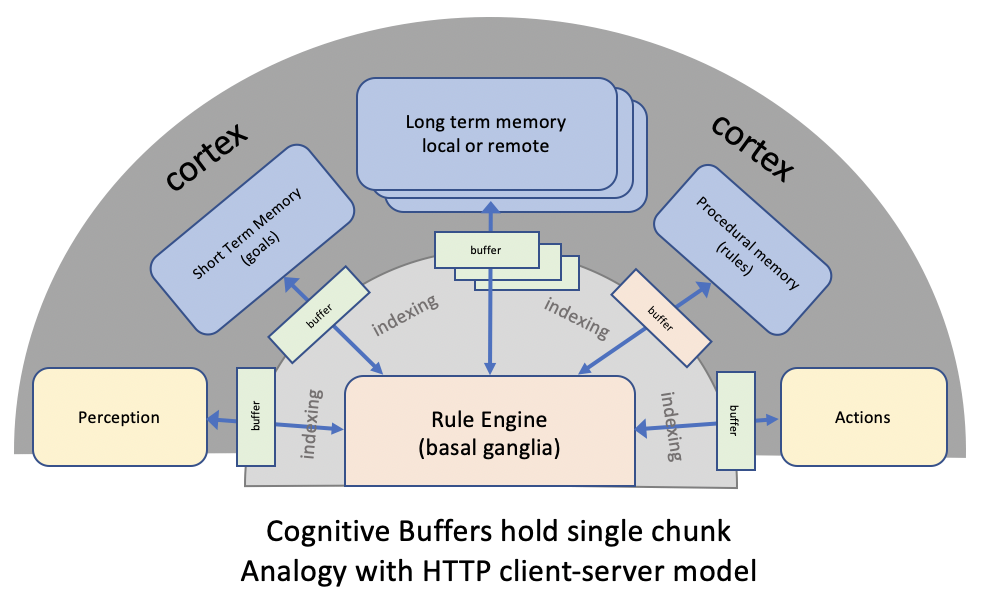

# W3C Cognitive AI Community Group
This repository is for work by the [W3C Cognitive AI Community Group](https://www.w3.org/community/cogai/).

## Table of contents

 - [Introduction](#introduction)
 - [Webinars](#webinars)
 - [Background materials](#background-materials)
 - [Program of work](#program-of-work)
 - [Positioning relative to existing approaches to AI](#positioning-relative-to-existing-approaches-to-ai)
 - [Next Generation Artificial Neural Networks (ANNs)](#next-generation-artificial-neural-networks-anns))
 - [Historical context](#historical-context)
 - [Cognitive Architecture](#cognitive-architecture)
 - [Long Term Aims](#long-term-aims)
  
## Introduction

According to [wikipedia](https://en.wikipedia.org/wiki/Cognitive_science):

<blockquote>
Cognitive science is the interdisciplinary, scientific study of the mind and its processes. It examines the nature, the tasks, and the functions of cognition. Cognitive scientists study intelligence and behavior, with a focus on how nervous systems represent, process, and transform information.
</blockquote>

Cognitive AI can be defined as AI based upon insights from the cognitive sciences, including cognitive neuroscience, and cognitive sociology.  To put it another way, the brain has evolved over hundreds of millions of years, and we would do well to borrow from nature when it comes to building AI systems.

The W3C Cognitive AI Community Group seeks to demonstrate the potential of Cognitive AI through:

* Collaboration on defining use cases, requirements and datasets for use in demonstrators
* Work on open source implementations and scaling experiments
* Work on identifying and analysing application areas, e.g.
  * Helping non-programmers to work with data
  * Cognitive agents in support of customer services 
  * Smart chatbots for personal healthcare
  * Assistants for detecting and responding to cyberattacks
  * Teaching assistants for self-paced online learning
  * Autonomous vehicles
  * Smart manufacturing
  * Smart web search
* Outreach to explain the huge opportunities for Cognitive AI
* Participation is open to all, free of charge: [join group](https://www.w3.org/community/cogai/join)

We are using GitHub for documents, issue tracking and open source components. We have a [public mailing list](https://lists.w3.org/Archives/Public/public-cogai/), and an [IRC channel](https://www.w3.org/wiki/IRC) **#cogai**.

## Current Work

* [Neural Networks for Human-like AI](agents/README.md)
* [Chunks and Rules](https://w3c.github.io/cogai/chunks-and-rules.html)
  * [Application to low-code control of digital twins](https://w3c.github.io/cogai/agents/low-code-with-chunks-and-rules.pdf)
* [Plausible Knowledge Notation](https://w3c.github.io/cogai/pkn.html)

## Webinars

This is a series of recorded webinars, see [webinar planning](webinars/README.md)

* 7 March 2024, The role of symbolic knowledge at the dawn of AGI, as presented to the Estes Park Group: [slides](https://www.w3.org/2024/03-Raggett-estes-park.pdf), and [video recording](https://www.youtube.com/watch?v=OdtpzE67W1U)

## Background materials

* Talks
  * 08 July 2025 [cognitive control of digital twins in swarm system](demos/Swarms/tasks/Raggett-cognitive-digital-twins.pdf)
  * 05 September 2024 [Application to low-code control of digital twins](https://w3c.github.io/cogai/agents/low-code-with-chunks-and-rules.pdf), talk at Swarm Computing Workshop, Brussels
  * 04 July 2023 [Combining Digital Twins with Cognitive Agents](https://www.w3.org/2023/07-Raggett-SimSwarm.pdf), talk at ETSI IoT Week 2023
  * 14 June 2023 [Human-like AI: from logic to argumentation, reasoning with imperfect knowledge in the era of AGI](http://www.w3.org/2023/06-Human-like-AI.pdf), see [video recording](https://youtu.be/GMDGbRQSWyo) talk for Darmstadt Ontology Group
  * 18 April 2023 [Human-Like AI for Artificial General Intelligence](http://www.w3.org/2023/04-Raggett-towards-AGI.pdf), as part of the [Special day on Human-AI interaction, DATE 2023](https://www.date-conference.com/call-for-papers#Special-Day-on-Human-AI-Interaction)
  * 20 February 2023 - [Human-like AI for Artificial General Intelligence - research challenges for the Intelligent Web of Things](https://www.w3.org/2023/02-Raggett-towards-AGI.pdf))
  * 14 November 2022 - [Cognitive Agents, Plausible Reasoning and Scalable Knowledge Engineering](https://www.w3.org/2022/11/Raggett-AI-Priorities.pdf), Workshop on Computing across the Continuum for the US NSF and the European Commission
  * 12 September 2022 - [Plausible reasoning and artificial minds](https://www.w3.org/2022/09/ATA-Raggett-2022-09-12.pdf), [Workshop on Analogies: from Theory to Applications](https://iccbr-ata2022.loria.fr/)
  * 16 February 2022 - [Imperfect Knowledge](https://www.w3.org/2022/02/16-DKG-22-Raggett.pdf), [Distributed Knowledge Graphs workshop](https://easychair.org/cfp/dkg-22)
  * 06 September 2021 - [Digital Transformation using chunks as a simple abstraction above triples and property graphs](https://www.w3.org/2021/chunks-rdf-pg-2021-09-06.pdf) - talk at the Semantics2021 workshop on squaring the circle on graphs
  * 17 March 2021 - [Digital Transformation and the Knowledge Economy](https://www.w3.org/2021/digital-transformation-2021-03-17.pdf), an invited keynote for the Siemens conference on the IoT
  * 17 March 2021 - [Roadmap for realising general purpose AI](https://www.w3.org/2021/roadmap-2021-03-17.pdf)
  * 14-19 February 2021 - Human-like AI and the Sentient Web for [Dagstuhl seminar on autonomous agents on the Web](https://www.dagstuhl.de/en/program/calendar/semhp/?semnr=21072) - [slides](https://www.w3.org/2021/sentient-web-2021-01-11.pdf), [paper](https://www.w3.org/2021/Human-like-AI-article-raggett-long.pdf)
  * 11 January 2021 - [Presentation and discussion of work on Cognitive Natural Language Processing](https://www.w3.org/2021/Cognitive-NLP-2021-Jan.pdf)
  * 25 November 2020 - Seminar on Cognitive AI for [Centre for Artificial Intelligence, Robotics and Human-Machine Systems](https://www.cardiff.ac.uk/artificial-intelligence-robotics-and-human-machine-systems), Cardiff University: [slides](https://www.w3.org/2020/CogAI-2020-11-25.pdf), [video](https://www.youtube.com/watch?v=gJiDi3lqwcA&feature=youtu.be)
  * 06 November 2020 - [Seminar on Cognitive AI for Knowledge Media Institute, Open University](http://kmi.open.ac.uk/seminars/3552) -  [video](https://github.com/w3c/cogai/blob/master/faq.md) and [slides](https://www.w3.org/2020/CogAI-2020-11-06.pdf)
  * 08 June 2020 - [Cognitive AI and the Sentient Web for ISO/TC 211 50th Plenary meeting, WG4 Geospatial Services](https://www.w3.org/2020/sentient-web-20200608.pdf)
* [Chunks format for declarative and procedural knowledge](chunks-and-rules.md)
* [Common Sense Reasoning](demos/nlp/commonsense.md)
* [Demonstrators](demos/README.md)
* [Frequently asked questions](faq.md)
* [Longer treatise on Cognitive AI](https://www.w3.org/Data/demos/chunks/chunks.html)
* [Contributing to the Cognitive AI Community Group](Contributing.md)

## Program of work

The initial focus is to describe the aims for a sequence of [demonstrators](demos/README.md), to collaborate on the scenarios, detailed use cases, and associated datasets, and to identify and discuss questions that arise in this work. In relation to this, we are working on a [formal specification of the chunk data and rules format](https://w3c.github.io/cogai/chunks-and-rules.html) with a view to its standardisation.

A further line of work deals with the means to express and reason with imperfect knowledge, that is, everyday knowledge subject to uncertainty, imprecision, incompleteness and inconsistencies. See the draft specifcation for the [plausible knowledge notation](https://w3c.github.io/cogai/pkn.html) (PKN), and the [web-based PKN demonstrator](https://www.w3.org/Data/demos/chunks/reasoning/). This is based upon work on guidelines for effective argumentation by a long line of philosophers since the days of Ancient Greece. In place of logical proof, we have multiple lines of argument for and against the premise in question just like in courtrooms and everyday reasoning. 

Both PKN and chunks & rules can be considered in relation to RDF. RDF is a framework for symbolic graphs based upon labelled directed graph edges (aka *triples*). Compared to RDF, PKN and chunks & rules are higher level with additional semantics, and designed for use in human-like AI applications. Furthermore, both notations are designed to be easy to read and author compared with RDF serialisations such as RDF/XML, Turtle and even JSON-LD. See also the [Notation3 (N3) Language](https://w3c.github.io/N3/spec/) which is an assertion and logic language defined as a superset of RDF.

Work is now underway on vector-space representations of knowledge using artificial neural networks. Advances with generative AI have shown the huge potential of vector-space representations in combination with deep learning. However, there is a long way to go to better model many aspects of human cognition, e.g. continual learning using a blend of type 1 and type 2 cognition, episodic memory, and the role of emotions and feelings in directing cognition. Symbolic models will continue to serve an important role for semantic interoperability and explainability.  Neurosymbolic systems combine the complementary strengths of vector space and symbolic approaches. For more details see [Neural Networks for Human-like AI](agents/README.md) and [task-based orchestration](demos/Swarms/tasks/README.md).

## Positioning relative to existing approaches to AI

Traditional AI focuses on symbolic representations of knowledge and on mathematical logic, e.g. Expert Systems and the Semantic Web. Deep Learning, by contrast, focuses on statistical models implemented as multi-layer neural networks. Both approaches have their weaknesses. Symbolic AI has difficulties with the ambiguities, uncertainties and inconsistencies commonplace in everyday situations. Furthermore, the reliance on manual knowledge engineering is a big bottleneck. Deep Learning has problems with recognising what’s salient, providing transparent explanations, the need for very large data sets for training, and difficulties with generalisation. Symbolic AI and Deep Learning are associated with siloed communities that typify modern science in which researchers are discouraged from interdisciplinary studies and the breadth of views that those encompass.

Cognitive AI seeks to address these weaknesses through mimicking human thought, taking inspiration from over 500 million years of neural evolution and decades of work across the cognitive sciences. This involves the combination of symbolic and statistical approaches using functional models of the human brain, including the cortex, basal ganglia, cerebellum and limbic system. Human memory is modelled in terms of symbolic graphs with embedded statistics reflecting prior knowledge and past experience. Human reasoning is not based upon logic, nor on the laws of probability, but rather on mental models of what is possible, along with the use of metaphors and analogies.

Research challenges include mimicry, emotional and social intelligence, natural language and common sense reasoning. Mimicry is key to social interaction, e.g. a baby learning to smile at its mother, and young children learning to speak. As a social species, we pay attention to social interaction and models of ourselves and others, including beliefs, desires, judgements and behaviours. Emotional control of cognition determines what is important, and plays a key role in how we learn, reason and act. Natural language is important for both communication and for learning and the means to break free from the manual programming bottleneck. Common sense is everyday knowledge and key to natural language understanding, and is learned through experience.

## Next Generation Artificial Neural Networks (ANNs)

Today’s ANNs use a lot of electrical power especially for training. This is creating a big demand on the national grid and acts as a downside for the expanded use of AI. The brain uses just a few watts, perhaps 20W, and is five orders of magnitude more power efficient than GPUs. The brain features local analog processing and spikes for long range communication. Can we match that?

A very promising approach is to use light pulses conveyed via optical waveguides as a replacement for electrical conductors within and between integrated circuits. This is faster and uses less power. We can build upon the extensive experience with CMOS fabrication with silicon on insulator (SOI) for hybrid photonic devices that combine electronic and optical components in the same chip. Silicon is transparent for wavelengths above 1.1 microns and has a very large refractive index (3.5) compared to silicon dioxide (1.4). Silicon's indirect bandgap makes it unsuitable for LEDs and photo diodes. One way to get around that is use InAs/GaAs grown on silicon substrates, however, a more promising approach uses germanium on silicon for infrared detectors, e.g. telecom's wavelengths such as 1.3 microns and 1.5 microns. Strained germanium on silicon can be used for emitters, but a more promising approach is to use germanium-tin alloys (GeSn).

Another potential approach is to use quantum dots which trap electrons and have discrete excitation bands similar to individual atoms. Silicon quantum dots (SiQD) with a size of 1 to 10 nanometres can be used for emitting and detecting light in a wide range of wavelengths from the near infrared to red/orange, but not so far for wavelengths where bulk silicon is transparent (wavelengths greater than 1.1 microns).

It might seem reasonable to look for ways to fabricate wave guides for red light where silicon is opaque. Silicon dioxide is highly transparent for visible light, but has the disadvantage of a much lower refractive index compared to bulk silicon. To avoid leaky waveguides, the cladding material needs to have a lower refractive index. Air is fine for this, but silicon is not. This makes it preferable to stick to infrared light where silicon is transparent. SiQDs can be also used for beam splitters and other optical devices.  Silicon waveguides, just nanometres across, can efficiently transport infrared photons, even around tight bends, enabling a high density of communication paths. 

For computing we need memory. Resistive random access memory (ReRAM) is based upon memristors, and can be integrated alongside CMOS electronic gates and optical waveguides. Memristors have a resistance that depends on the voltage and current previously applied to them. Memristors could  be used to mimic synapses for neuromorphic computing, and can be fabricated using amorphous silicon doped with oxygen or nitrogen, or by using silicon dioxide layers on silicon hydride surfaces. Memristors are much smaller than flash memory cells and simpler to drive. Silicon foundries are moving towards 2 nanometre resolution using extreme ultraviolet (EUV) lithography, which should be sufficient for hybrid photonics.

Of course there are many challenges to address before this technology can become widespread. This includes surface passivation and physical encapsulation within a protective matrix, as well as connectivity to photonic chips compared to the ease of bonding wired connections.  We are also likely to need new architectures for neural networks that feature continual learning through continual prediction, and weight adjustments at a layer by layer basis, replacing today’s gradient-based back propagation. Another motivation is that adversarial attacks suggest that today’s AI is different from human cognition, e.g. adding some carefully chosen noise to an image of a panda causes the model to misclassify it as a gibbon with a high degree of confidence, despite the noise being imperceptible to the human eye. Similar considerations apply to prompt injection jail breaks that evade the alignment training for LLMs.

## Historical context

AI lacks a precise agreed definition, but loosely speaking, it is about replicating intelligent behaviour, including perception, reasoning and action. There are many sub-fields of AI, e.g. logic and formal semantics, artificial neural networks, rule-based approaches including expert systems, statistical approaches including Bayesian networks and Markov chains, and a wide variety of approaches to search, pattern recognition and machine learning. Cognitive AI seeks to exploit work across the cognitive sciences on the organising principles of the human mind.

Chunk rules are a form of *production rules* as introduced by [Allen Newell](https://en.wikipedia.org/wiki/Allen_Newell) in 1973 in his production system theory of human cognition, which he subsequently developed as the [SOAR](https://en.wikipedia.org/wiki/Soar_(cognitive_architecture)) project. [John Anderson](https://www.cmu.edu/dietrich/psychology/people/core-training-faculty/anderson-john.html) published his theory of human associative memory (HAM) in 1973, and inspired by Newell, went on to combine it with a production system to form the *ACT* system in 1976, and developed it further into *ACT-R* in 1993. [ACT-R](http://act-r.psy.cmu.edu/about/) stands for *adaptive control of thought - rational* and has been widely applied to cognitive science experiments as a theory for simulating and understanding human cognition. For more details see <a href="http://act-r.psy.cmu.edu/wordpress/wp-content/uploads/2012/12/526FSQUERY.pdf">An Integrated Theory of the Mind</a>. Chunks, in turn, was inspired by ACT-R, and the realisation that the approach could be adapted for general use in artificial intelligence as the combination of graphs, statistics, rules and graph algorithms.

Credit is also due to [Marvin Minsky](https://en.wikipedia.org/wiki/Marvin_Minsky) for his work on frames, metacognition, self-awareness and appreciation of the importance of emotions for controlling cognition, to [Philip Johnson-Laird](https://en.wikipedia.org/wiki/Philip_Johnson-Laird) for his work on [mental models](https://www.pnas.org/content/107/43/18243) and demonstrating that humans don't reason using logic and probability, but rather by thinking about what is possible, to [George Lakoff](https://en.wikipedia.org/wiki/George_Lakoff) for his work on [metaphors](https://en.wikibooks.org/wiki/Cognitive_Science:_An_Introduction/Metaphor_and_Analogy), [Dedre Gentner](https://en.wikipedia.org/wiki/Dedre_Gentner) for her work on [reasoning with analogies](https://reasoninglab.psych.ucla.edu/wp-content/uploads/sites/273/2021/04/Gentner-and-Holyoak-1997.pdf), and to [Allan Collins](https://allancollins.northwestern.edu/) for his work on plausible reasoning. Cognitive AI has a broader scope than ACT-R and seeks to mimic the human brain as a whole at a functional level, inspired by advances across the cognitive sciences. As such, Cognitive AI can be contrasted with approaches that focus on logic and formal semantics. Cognitive AI can likewise be decoupled from the underlying implementation, as the phenomenological requirements are essentially independent of whether they are realised as explicit graphs, vector spaces or pulsed neural networks, see David Marr's [three levels of analysis](https://en.wikipedia.org/wiki/David_Marr_(neuroscientist)#Levels_of_analysis). 

## Cognitive Architecture

The following diagram depicts how cognitive agents can be built as a collection of different building blocks that connect via the cortex, which functions as a collection of cognitive databases and associated algorithms. Semantic integration across the senses mimics the Anterior Temporal Lobe's role as a hub for the unimodal spokes. The initial focus of work was on a chunk rule engine inspired by John Anderson's ACT-R. Current work is focusing on plausible reasoning and belief revision. Future work will look at the other building blocks.

 
Image of cognitive architecture as a set of modules connected via the cortex

* **Perception** interprets sensory data and places the resulting models into the cortex, e.g. scene graphs. Cognitive rules can set the context for perception, and direct attention as needed. Events are signalled by queuing chunks to cognitive buffers to trigger rules describing the appropriate behaviour. A prioritised first-in first-out queue is used to manage events that are closely spaced in time.
* **Emotion** is about cognitive control and prioritising what’s important. The limbic system provides rapid assessment of past, present and imagined situations without the delays incurred in deliberative thought. Emotions are perceived as positive or negative, and associated with passive or active responses, involving actual and perceived threats, goal-directed drives and soothing/nurturing behaviours.
* **Cognition** is slower and more deliberate thought, involving sequential execution of rules to carry out particular tasks, including the means to invoke graph algorithms in the cortex, and to invoke operations involving other cognitive systems. Thought can be expressed at many different levels of abstraction, and is subject to control through metacognition, emotional drives, internal and external threats.
* **Action** is about carrying out actions initiated under conscious control, leaving the mind free to work on other things. An example is playing a musical instrument where muscle memory is needed to control your finger placements as thinking explicitly about each finger would be far too slow. The Cerebellum provides real-time coordination of muscle activation guided by perception, computing smooth functions over time.

<!-- **Perception** involves interpreting sensor data in the current context, focusing attention on things of interest, and placing short lived representations in the cortex. **Emotion** is about fast, intuitive assessments of the current situation and potential courses of action. **Cognition** is slower and more deliberate thought, involving sequential execution of rules to carry out particular tasks. Thought can be expressed at many different levels of abstraction. **Action** is about carrying out actions initiated under conscious control, leaving the mind free to work on other things. An example is playing a musical instrument where muscle memory is needed to control your finger placements as thinking explicitly about each finger would be far too slow. -->

Zooming in on cognition and the role of the basal ganglia as a sequential rule engine, the architecture looks like:

 
Image of cognitive architecture for deliberative reasoning (System 2)

This has been implemented as an open source JavaScript library and used as the basis for an [evolving suite of demos](demos/README.md).

New work is underway on vector space approaches inspired by human cognition and the advances in generative AI. This will mimic human language processing (sequential, hierarchical and predictive), implicit and explicit memory, continual learning, and Type 1 and 2 cognition. This is being implemented in Python and PyTorch. Language processing uses retained feedback connections in conjunction with a small sliding window to mimic the buffering limitations of the phonological loop. Type 2 cognition features a vector based implementation of chunks and rules. Explicit memory (episodic and encyclopaedic) is based upon a vector database designed to mimic characteristics of human memory (forgetting curve, spreading activation and spacing effect). The different modules are integrated through shared access to the latent semantics (loosely equivalent to the buffers in the above diagram).

## Long Term Aims

In the long run, the mission of the Cognitive AI Community Group is to enable cognitive agents that:

* Are knowledgeable, general purpose, creative, collaborative, empathic, sociable and trustworthy
* Can apply metacognition and past experience to reason about new situations
* Support continual learning based upon curiosity about the unexpected
* Have a level of self awareness in respect to current state, goals and actions
* Have an awareness of others in respect to their beliefs, desires and intents
* Are multilingual and can interact with people using their own language

These topics can be divided into areas for study and exploration with an emphasis on identifying use cases and building demonstrators that advance the overall mission. There is plenty to exploit along the way, with many opportunities to spin off practical applications as work proceeds.

p.s. [useful tips on using GitHub for W3C projects](https://w3c.github.io/)
