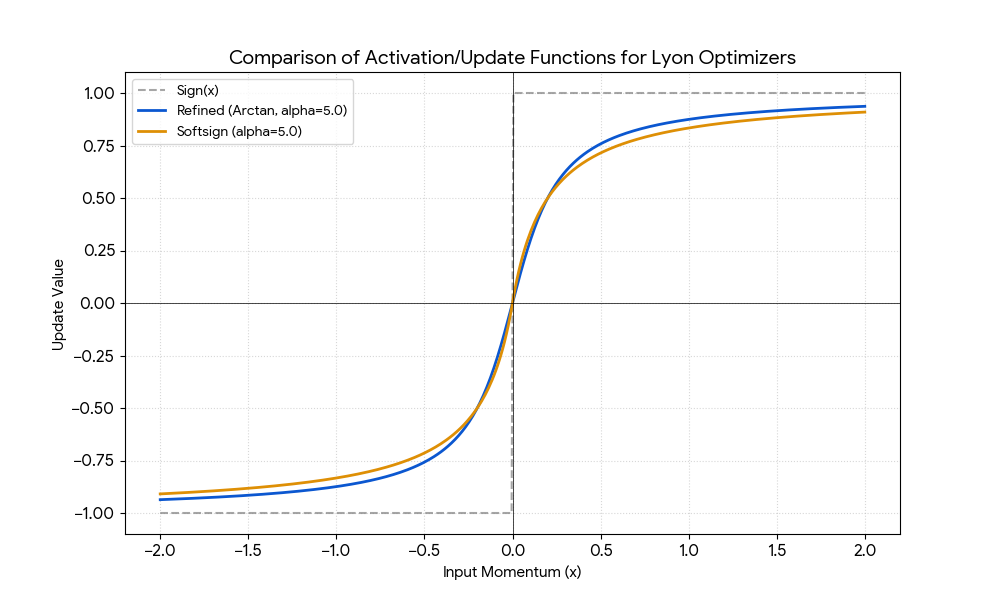

# WebNNM for Browser AI
Existing neural network frameworks, e.g. TensorFlow and ONNX, are huge and hard to use. WebNNM is a lightweight easy to understand framework that dramatically simplifies working with neural networks.

WebNNM uses a simple model format together with a small open source JavaScript library (`webnnm.js`) for use with WebNN, W3C's platform-neutral neural network API for web browsers, with backends for NPUs, GPUs and CPUs. The library compiles models into inference, testing and training graphs. Automated inference is used to determine the shapes of trainable parameters from layer inputs, outputs and non-trainable parameters. The complementary `dataset.js` module provides a parent class for dataset specific classes, and can be used for training and testing models against your chosen dataset. This lends itself to privacy friendly federated learning where the user data never leaves the browser. 

Running neural network models in the browser is well suited to small to medium sized models, such as those used for image classification, and real-time processing of audio and video. Large language models with many billions of parameters will still need to be run in the cloud. WebNN uses `int32` for tensor dimensions and likewise limits the maximum tensor size (in bytes) to 2,147,483,647, equivalent to 1 billion `float16` numbers. For scalable extended reality applications this points to a distributed approach combining the edge and cloud to maximum advantage.

As an introduction, please take a look at the following demos:
* [Inference with dense layers](https://www.w3.org/2026/webnnm/examples/test1.html)
* [Inference with numeric literals](https://www.w3.org/2026/webnnm/examples/test2.html)
* [Testing against a small dataset](https://www.w3.org/2026/webnnm/examples/test3.html)
* [Training against a small dataset](https://www.w3.org/2026/webnnm/examples/test4.html)

A detailed specification for the `webnnm.js` library is in preparation and will be linked from here.

## Developer Notes
`webnnm.js` is a work in progress. We are extending the library to cover all of the WebNN operators as well as a few others, e.g. to handle skip connections, transformers, and newer operators such as `squaremax`. The library is object-oriented with `NNModel` as the top level class. Models are parsed into instances of `NNBlock`, `NNLayer` and `NNTensor`. These are in turn mapped into a directed acyclic graph of nodes using the `NNTopology` and `NNNode` classes.  The latter is the parent class for operator specific subclasses that support shape inference and transpiling into executable WebNN graphs under control of the `NNEngine` class. `NNTopology` sorts the DAG nodes into execution order, pruning nodes that aren't on a path from an input, parameter or literal to a model output. `NNContext` class provides the context for running models in inference mode.

For inference, model parameters are baked into the graph as constants, reducing the time to prepare the next batch. During training a ping/pong approach is used for the parameters and their momentum to keep the tensors in the NPU or GPU, only reading the updated parameters after the final epoch. The implementation uses a variant of the [Refined Lion optimiser](https://www.nature.com/articles/s41598-025-07112-4) which offers faster convergence using less memory than [AdamW](https://optimization.cbe.cornell.edu/index.php?title=AdamW). Our implementation uses the softsign function $f(x) = x / (1 + |x|)$ in place of *arctan*, which isn't supported by WebNN. Softsign is continuous and differentiable everywhere, is faster to compute, and like *arctan*, smooths out the discrete steps of the original Lion optimizer. You can also choose other optimizers: [Stochastic Gradient Descent with Momentum](https://arxiv.org/abs/2602.23444) (SGDM), [Nesterov Accelerated Gradient](https://hengshuaiyao.github.io/papers/nesterov83.pdf) (NAG) and [EvoLved Sign Momentum](https://arxiv.org/abs/2310.05898) (Lion).

  

Support for saving and loading binary files with the model and parameters is in development and will be integrated shortly. We also expect to develop supplementary libraries for importing models in other formats, e.g. ONNX and Hugging Face. These libraries will be usable with NodeJS as well as with web pages. One challenge is the potential for decompiling lower level models, such as those using ONNX, to higher level easier to understand models expressed in WebNNM.

Further out, we hope to apply WebNNM to multimodal models for video and audio as a basis for acccessible virtual worlds, where the phone or laptop's camera and microphone are used to capture the user's facial expressions and project them onto the user's avatar, along with speech to text support for intent-based accessibility, since everyone should be able to choose how they interact with applications according to their personal preferences and capabilities. One person may be happy with a games controller, whilst others may prefer to use their voice to convey higher level intents. Other work is planned on moving beyond back propagation to support continual learning and short term memory, inspired by human cognition.

Back propagation is like trying to learn many complex skills all at the same time, which slows training. We hope to exploit research on speeding up training, especially for small to medium sized models. This includes mixture of experts, curriculum training, progressively growing the network, elastic weight consolidation, lightweight adapters, and experience replay, along with techniques such as layer-wise prediction (*aka* predictive coding) and hebbian training. If you would like to help with this, please get in touch!

## Some useful terms:

**Model:** The complete network architecture, including its layers and learned parameters, designed to perform a specific task, e.g., classification.

**Model Layout:** The specific arrangement or structure of layers (e.g., sequential, parallel, residual) within a neural network model, defining the flow of data.

**Layer**: A module or processing unit within the model that performs a specific transformation on its input data. Layers can be divided into sublayers, as a means to modularise the network architecture.

**Non-sequential Layers**: e.g. *residual networks* with skip connections, *inception networks* that apply in parallel several different types of convolutions with a max-pooling operation, *U-Net* with encoder-decoder networks as used for image segmentation, *dense networks* where every neuron in one layer is connected to every single neuron in the following layer. Skip connections are essential for networks with many layers as a means to avoid vanishing gradients that inhibit training.

**Tensor:** A multi-dimensional array used to represent data (input, output, parameters) in a neural network. The array items are associated with a data type. WebNN supports the following datatypes: float32, float16, int32, uint32, int8, uint8, int4, and uint4. Training typically benefits from higher precision (like float32) to maintain numerical stability during millions of tiny weight updates, whereas inference can often be "quantized" to lower precision (like int8 or float16) to maximize speed and reduce memory usage without significantly hurting accuracy.

**Tensor Layout**: how the tensor's data is arranged in memory, *layout* refers to the specific *ordering of the axes (dimensions)* of the tensor. This dictates how the multi-dimensional data is linearized (flattened) for storage in the computer's one-dimensional memory space.

**Shape:** The dimensions of a tensor, specifying the size of each axis, e.g. [3, 224, 224] for an image. Input tensor shapes typically start with the batch size, then the sequence length (temporal models), followed by the features. For images, features include channels (e.g. RGB colours), height and width. *NCHW* places channels before positional information (generally best for modern GPUs), whilst *NHWC* does the reverse.

**Reshaping**: is the process of changing the dimensions of a tensor without altering its underlying data or the total number of elements, essentially "reinterpreting" how the data is laid out in memory. It is used to flatten data, for batch prepararation and dimension alignment.

**Operators**: mathematical operations applied to the *operands* to compute the output, and subject to operator specific *options*.

**Broadcasting**: allows operations between tensors of different shapes by virtually "stretching" the smaller tensor to match the dimensions of the larger one without actually copying the data in memory.

**Layer normalization**: is a technique that improves training performance by standardizing the activations of a single layer for each individual sample by calculating the mean and variance across all its features, ensuring that the inputs to the next layer remain within a stable numerical range.

**Max pooling**: is a downsampling operation that slides a window over an input (like an image) and selects only the maximum value within that window to represent the entire area.

**Non-trainable parameters**: static parameters that are given explicitly in the model and not subject to training.

**Hyperparameters:** Configuration settings (e.g. learning rate, number of layers) that are set **before** training and remain constant.

**Gradient Descent**: is an iterative optimization algorithm that calculates the "slope" of the error and adjusts the model's parameters in the opposite direction to find the lowest possible point of the loss function.  Successful training depends on avoiding vanishing or exploding gradients. This can be mitigated through a variety of techniques, e.g. skip connections, layer normalization, adjustment to the learning rate and the choice of tensor initialisation algorithms, e.g. Glorot or He, as appropriate the the activation function. WebNNM uses context-senstive heuristics for initialising model parameters.

**Momentum**: is an enhancement to gradient descent that accumulates a moving average of past gradients to help the optimizer accelerate through flat regions and dampen oscillations in steep, narrow valleys.

**Graphs**: are composed of nodes and arcs. Artificial neural networks form directed acyclic graphs where arcs are tensors, and the nodes are operators, inputs, outputs, trainable parameters, or literals, e.g. explicit numbers. An *inference graph* computes the outputs from the inputs. A *testing graph* computes a measure of the loss, e.g. the difference between the predicted and expected outputs. A *training graph* computes updates to trainable parameters and their momentum. The graph has three stages: the first computes the output from each layer and the overall loss, the second computes the gradients, i.e. partial derivative of the loss with respect to each parameter. The third and final part applies the optimizer algorithm to compute updates to trainable parameters and their momentum.

**Datasets**: used for training models are typically split into three subsets: training, validation and testing.  The training subset is used for training. The validation subset is used to tune settings and monitor performance during training, and may be omitted for smaller datasets. The testing subset provides a final, unbiased evaluation of the finished model.

**Epoch**: represents one full pass of the entire training dataset through the neural network, used to give the model multiple opportunities to learn patterns and minimize error across all available data. Gradient descent usually requires many epochs to converge.

**Overfitting**: occurs when a model memorizes noise and specific details of the training data rather than learning general patterns, making a separate testing subset essential to objectively measure how well the model performs on new, unseen information.

**Batches**: are used to divide a dataset into smaller groups to make the training process more memory-efficient and to provide more frequent, stable updates to the model's weights via gradient descent.

**Sequence**: a structured ordering of data points, such as words in a sentence or daily stock prices, used to help a model capture temporal dependencies and context where the meaning of an element depends on what came before it.

