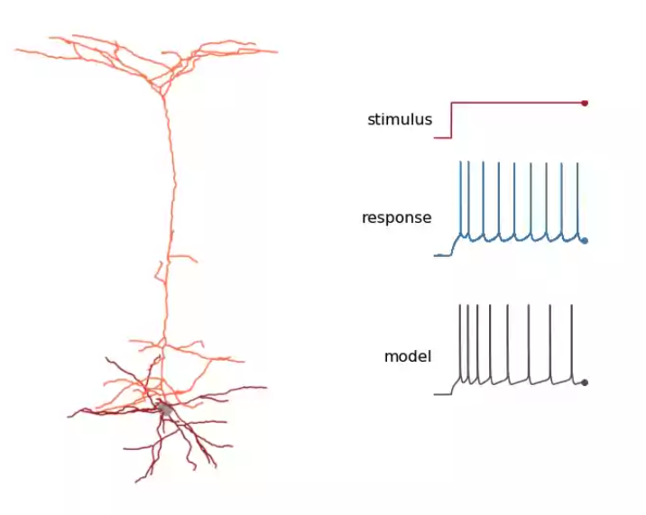

# Incremental Learning

Artifical neural networks are trained to minimise the difference for a given input between the target output and the output generated by the network. This difference is represented by a loss function.

Back propagation is an efficient means to compute the gradient of model parameters with respect to the loss function.  It relies on the chain rule to incrementally compute gradients progressing backwards from the output layer to the input layer. The model parameters are then updated by multiplying the gradient by the learning rate, which is typically a small positive number between 0.01 and 0.0001.

The actual value is usually automatically adjusted using an algorithm such as the Adam Optimiser. This adjusts the learning rate individually for each model parameter based upon estimating the rate of change of its gradient. A small learning rate means that each new data sample will only have a small effect on the model.

This makes back propagation ineffective for incremental learning where you want to be able to store, recall, and learn from individual data samples. This is key to survival for animals in a hostile environment, as animals that learn quickly are more likely to survive and reproduce.  We thus need an alternative framework for learning.  The brain is very unlikely to use back propagation, but is good at incremental and one-shot learning.  This provides grounds for optimism in respect to finding effective algorithms for artificial neural networks.

The short term aim is to figure out how to implement a testbed for incremental learning inspired by work on pulsed neural networks. In essence, back propagation is used to train a learning signal generator which in turn guides synaptic updates for single shot learning.  The learning signal could apply to a group of neurons or be tailored to individual neurons. This is something we need to experiment with.

### e-prop and pulsed neural networks

* [A solution to the learning dilemma for recurrent networks of spiking neurons](https://www.nature.com/articles/s41467-020-17236-y) (2020), Bellec et al.
* [One-shot learning with spiking neural networks](https://www.biorxiv.org/content/10.1101/2020.06.17.156513v1.full.pdf) (2020), Scherr, Stöckl, and Maass

Back propagation through time (BPTT) and recursive optimisation of a loss function is unlikely to be used by biological neural networks, and moreover is slow for recurrent networks.  A more plausible account involves local learning under direction of learning signals. The latter includes chemical signals, i.e. neurotransmitters such as dopamines that target classes of neurons.  Hebbian learning involves adjustments to parameters based upon correlations between the inputs and outputs for a neuron.

The simplest model of pulsed neurons involves a leaky integration of input pulses with a threshold for firing a pulse (LIF). A refined model allows for spike frequency adaptation (SFA) in which the threshold is slightly increased by recent activity. This is revealed by an increase in pulse interval for a constant stimulus. 

 <em>Courtesy of the <a href="https://celltypes.brain-map.org/overview">Allen Brain Atlas</a>
</em>

The brain features both feedback and lateral connections in addition to feedforward connections.  Lateral connections are either local or remote, e.g. connecting different areas in the Neocortex. Recurrently connected neural networks are more powerful than feedforward networks as feedback can support tasks that require combination of information over time.  Spike frequency adaptation further increases the computational power, analogous to LSTM networks.

The neuron and its synapses are chemically effected by recent activity and this can lead to long term changes when closely followed by a top-down learning signal that is optimised across a collection of similar tasks.

The loss gradient with respect to a given connection weight $W_{ji}$ can be modelled as a sum over the product of learning signals $L^t_j$ and eligibility traces $\mathbf{\epsilon}^t_{ji}$ for presynaptic neuron $i$ to postsynaptic neuron $j$ at time $t$ as shown below:

$$
\Delta W_{ji} = -\eta {{dE}\over {dW_{ji}}} = -\eta\sum_t L^t_j e^t_{ji}
$$

The learning signal represents errors for the current time step. The eligibility trace is independent of the loss function $E$ and just depends on the history of activations of the pre- and post-synaptic neuron. How are the learning signal and eligibility trace computed?

Sherr et al. (see above link) describe how a separate recurrent spiking network can be used to estimate the learning signals and enable single-shot learning for related groups of tasks.

Training proceeds in two stages. The first stage applies learning to learn or meta-learning to the learning signal generator (LSG). An outer loop optimises the LSG parameters. An inner loop updates the learning network (LN) using equation 1.  The LSG  and the initial state of the LN is optimised using back propagation through time.  In the second stage, the LSG is kept constant and the performance of the LN evaluated against examples randomly chosen from the dataset.

The eligibility trace $e^t_{ji}$ is essentially a low pass filtered function of the spike train from the presynaptic neuron $i$ up to time $t − 1$ and a term that depends on the depolarization of the membrane of postsynaptic neuron $j$ at time $t$. It is a little more complicated for SFA neurons:

$$
e^t_{ji} = \frac{\partial z^t_i}{\partial \mathbf{h}^t_j}\cdot\mathbf{\epsilon}^t_{ji}
$$

where $\mathbf{h}^t_k$ is the internal state vector for neuron $j$ and  $\mathbf{\epsilon}^t_{ji}$ is a vector defined by:

$$
\mathbf{\epsilon}^t_{ji} = \frac{\partial \mathbf{h}^t_j}{\partial \mathbf{h}^{t-1}\_j}\cdot\mathbf{\epsilon}^{t-1}\_{ji} + \frac{\partial \mathbf{h}^t\_j}{\partial W_{ji}}
$$

Schorr et al don't define $z^t_i$ nor how to initialise $\mathbf{\epsilon}^t_{ji}$ for $t = 0$.  I am also unclear as how to compute partial differentials for state vectors except in relation to the relative change compared to the previous time slot.

##### Training data and loss function

The above framework for incremental training involves a loss function that compares predicted and target data.

* Masked data - where you try to predict the masked data
* Question/Answer pairs - where you try to predict the answers based upon the questions

I envisage a staged training programme that progressively introduces new concepts.  I expect to automatically generate the data.

This is likely to  need a separate approach for training the network used to estimate learning signals for each group of tasks.

##### From pulsed to continuous neurons

Whilst neuromorphic hardware for sparse pulsed neural networks is clearly the future on account of massive power reduction, the short term will depend on GPUs and TPUs. I need to port the algorithms from pulsed to continuous artifcial neurons.  I think a simple leaky capacitor model with a time constant of a few seconds may be sufficient for the eligibility traces, using a simple formula to update the firing threshold step by step and map this to the parameters for the non-linear transfer function in the continuous neuron.

I need to consider the details for computing the eligibility trace based upon the history of the inputs and outputs for a given neuron. I should look at how Hebbian learning is formulated.

##### Different kinds of memory traces

There are multiple ways for information to be held in a system that mimics the brain:

* Working memory: the current excitation values for neurons. In pulsed neural networks this corresponds to the firing rate or to the interval since the last pulse for sparse pulsed neural networks.
* The network parameters for feedforward and recurrent networks
* Short term memory (the Hippocampus)
* Long term memory (the Neocortex)

A weak analogy with computers holds that working memory corresponds to CPU registers, short term memory to RAM storage, and long term memory to SSD storage.

In conventional artificial neural networks, the network parameters are trained through gradient descent via back propagation through time.  Whilst feedforward networks can hold vast amounts of information, this approach is slow to train and unsuited to one-shot storage and retrieval of individual sequences.  The current activation values correspond to working memory which is distributed across the layers in the network.

Short term memory can be likened to a database that complements working memory, providing store and retrieve operations, allowing for deliberative reasoning that is open to introspection. Short term memory focuses on the current situation.  Long term memory by contrast focuses on learning across episodes and examples, as well as knowledge that holds across time, e.g. that birds are a kind of animal.

A further distinction is between tacit knowledge and explicit knowledge. Tacit knowledge is opaque and used to support Type 1 processing.  It cannot be easily expressed through words of pictures, and is subjective and experiential. Type 2 processing involves explicit knowledge that can be readily expressed and conveyed from one person to another.  The network parameters in large language models hold tacit knowledge. We need a different approach to hold explicit knowledge, that enables it to be accessed and updated as needed.

* *What kinds of neural networks can support explicit short and long term knowledge?*
* *How does the brain manage these different kinds of memory?*

##### Poverty of the Stimulus

* [Compositional Syntax From Cultural Transmission](https://eucaslab.github.io/downloads/2002.Brighton.ALIFE.pdf) (2002), Henry Brighton

Somehow children master language with surprisingly little data. Chomsky referred to this as the poverty of the stimulus (*Language and learning:* 1980) and used it to justify claims for an innate language acquisition capability (a genetically determined universal grammar).  An alternative account states that the poverty of the stimulus introduces a strong pressure for compositional structure given cultural pressures on language usage, including the tendency to mimic the speaking patterns of your peers and cultural influencers. Language is passed from one person to another, in a process resembling natural selection.

Children memorise language patterns in the context of the most likely meaning for each utterance.  Observing a given pattern implies a previously associated meaning if the pattern has been seen before. Otherwise, the meaning can be derived a process of generalisation or invention (plausible guesses). The associated meaning for memorised patterns is updated as further evidence is obtained. Brighton (above) suggests that language evolves as it spreads from person to person, and this acts as a preference for structured relationships between language and meaning, as these are better at surviving the transmission bottleneck.  In essence, language patterns that support generalisation are more likely to survive unscathed as they are passed around the population of language users.

How do children induce the likely meaning of utterances, and how is that influenced by memorisation? This may involve the context provided by preceding utterances in the conversation, as well as the child's own goals and intent, and those attributed to the speaker the child is listening to.  For a neural system, the context is represented by the current state of neural excitation (working memory) as well as the means to access short and long term memory.  Incremental learning is needed to update the network parameters and perform operations on short and long term memory.  There are many more details to add before a functional implementation becomes possible.

Brighton's paper describes an approach to modelling sequences using directed acyclic graphs along with a mechanism for edge and state merge operations as a basis for generalisation. He refers to this as a finite state unification transducer.  I wonder how this could be reformulated using neural networks? He doesn't clarify how the meaning is induced!  Perhaps I can figure out some form of supervised learning, but the question is how to express the meaning for each utterance.
