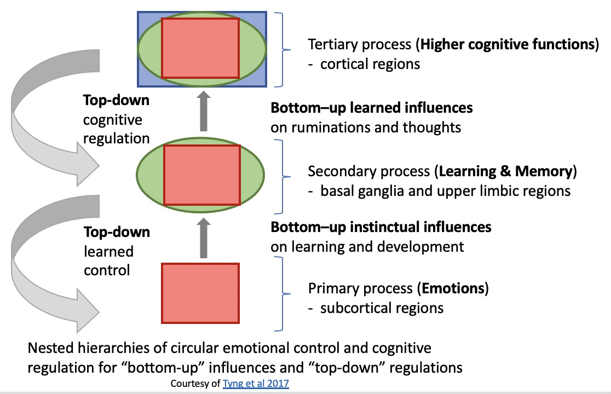

# Demonstrators

This page documents plans for developing a sequence of demonstrators that focus on different technical challenges, and together highlight the potential for Cognitive AI. The demos should be based upon cognitively plausible techniques involving graph data, graph rules and graph algorithms. Further demos will seek to apply these techniques to specific application areas.

## [Counting](counting/README.md)

* https://www.w3.org/Data/demos/chunks/counting/

This demo is borrowed from a tutorial for the popular Cognitive Science architecture [ACT-R](http://act-r.psy.cmu.edu/). The demo serves as an introduction to chunks and rules.

It generates a sequence of digits by counting up from an start value and ends with a finish value. This is done using three rules. One to commence the counting task, a second rule to advance to the next digit, and a third rule to terminate the task after reaching the target value. The demo recalls chunks from the facts module that give the successor digit, e.g. 5 comes after 4. The demo starts by injecting a chunk into the goal buffer to trigger the task.

An extended version of this demo could be developed to count beyond 9 with further rules and facts that support tens, hundreds and thousands etc.

## [Simple Decision Trees](decision-tree/README.md)

* https://www.w3.org/Data/demos/chunks/decision-tree/

This demo is borrowed from an old tutorial for ID3, and decides whether the weather is suitable for playing a game of golf. The weather conditions are randomly generated. The demo just uses the rules module with a decision tree implemented as a succession of rules. A future demo will cover machine learning of decision trees from examples. This will be followed by a suite of demos exploring machine learning of declararive and procedural knowledge, including the use of imagination/planning, case-based reasoning, and hierarchical reinforcement learning.

## [Autonomous Driving](driving/README.md) (under construction)

* https://www.w3.org/Data/demos/chunks/driving/

This demo simulates driving a car across a town, as a task familiar to most of us. The map data was exported from Open Street Maps to an XML file, and converted into a file in the chunks format. The map is modelled as points with latitude and longitude, and paths as a sequence of points that denote a road or footpath. The A* algorithm is used to find a route between any two points.

Vision is modelled in terms of the position of the car in the lane and the change of direction of the road at a gaze point ahead of the car. Road signs and upcoming junctions raise alerts that are injected into the goal buffer to trigger the corresponding rulesets. The cognitive agent controls the car in terms of braking or acceleration, signalling at junctions, and switching the steering mode between lane following, and traversing a junction. Steering and braking/accelerating are devolved to real-time control loops mimicking the cortico cerebellar circuit.

An extended version of this demo could include multiple road users, including pedestrians, cyclists and other cars, each simulated by a separate cognitive agent. This could be further combined with work on learning from experience and reasoning about how to handle new situations.

## [Natural Language Dialogues and Situational Plans](nld/README.md) (under consideration)

This demo features a dialogue between three cognitive agents that model a waiter at a restaurant, and two visitors who are having dinner together. The language is predictable and the intent is well understood, making this a good scenario for exploring natural language processing, simple dialogues, reasoning about preferences, plans and episodic memories.

Natural language is processed a word at a time, and mapped to a chunk graph that represents the meaning. This involves a lexicon of words, a simplified treatment of parts of speech and gramatical categories, and the use of spreading activation for word sense disambiguation, and bindings for prepositional phrases and pronouns etc.

## Further Demos

These are at a very early stage of consideration, and need work on selecting the scenarios, detailed use cases, and associated datasets.

### Learning from examples

This will be a series of demos focusing on techniques for learning knowledge graphs and decision trees from potentially noisy examples, using strongly supervised, weakly supervised, and unsupervised learning algorithms based on metrics for parsimonious representations. Humans are able to learn from small numbers of examples in contrast to today’s deep learning techniques which need very large numbers of examples. This is possible through effective use of statistics and prior knowledge. We're looking for help with surveying the literature for relevant algorithms and datasets. Here are just a few pointers:

* [Tour of machine learning algorithms](https://machinelearningmastery.com/a-tour-of-machine-learning-algorithms/), including regression, instance-based, regularisation, decision-trees, bayesian, clustering, association rule learning, artificial neural networks, deep learning, dimensionality reduction, ensemble and other machine learning algorithms.
* [CHREST](http://chrest.info/chrest.html) (Chunk Hierarchy and REtrieval STructures) is a symbolic cognitive architecture which treats long term memory as a discrimination network that sorts and stores chunks. This is also very relevant to demos exploring stimulus-response as a basis for feelings and emotions.
* [Automatic taxonomy construction](https://en.wikipedia.org/wiki/Automatic_taxonomy_construction) from a corpus of examples.
* [Quinlan's ID3 algorithm](https://hunch.net/~coms-4771/quinlan.pdf) describes a means to inductively learn decision trees from examples.
* [Covariance analysis](http://www.biostathandbook.com/ancova.html) provides a means to test for statistical significance of correlations in datasets.
* [One-shot learning](https://en.wikipedia.org/wiki/One-shot_learning) aims to learn information about object categories from one, or only a few, training samples/images.
* [Taxonomy vs Ontology: Machine learning breakthroughs](https://www.dataversity.net/taxonomy-vs-ontology-machine-learning-breakthroughs/) - a brief introduction.
* [Knowledge Graph Refinement](http://semantic-web-journal.net/system/files/swj1167.pdf) - a survey of approaches and evaluation methods.

### Learning Rulesets for Tasks

This focuses on hierarchical reinforcement learning, and will explore techniques for applying heuristics to propose/revise rules along with a stochastic temperature parameter controlling the level of caution in making changes.  A further demo would look at the potential for using reinforcement learning when imagining carrying out some sequence of actions.

### Discovering Causal Relationships

A suite of demos that apply statistical approaches to identify potential causal relationships. The simplest approach *(covariance analysis)* estimates statistical significance for correlations between pairs of variables, e.g. smoking and lung cancer. Newer techniques include *bivariate causal discovery*, see [Anish Dhir and Ciaran M. Lee](https://assets.babylonhealth.com/pdfs/Integrating-Overlapping-Dasets-Using-Bivariate-Causal-Discovery.pdf), and can be applied across multiple overlapping datasets to identify likely causal chains based upon membership of Markov equivalence classes. Humans and other animals can infer causal relationships from just a few examples, how can these techniques be used incrementally in a cognitively plausible manner?

### Different Kinds of Reasoning

A suite of demos exploring different kinds of reasoning, e.g. deductive, inductive, abductive, causal, reasoning from analogies, reasoning from multiple perspectives, reasoning about stories, and so forth. In some cases, this will involve the use of context chains where some things only hold in a particular context, whilst others hold more generally.

### Emotions and Cognition

A series of demos that explore the interplay of emotions and cognition, in terms of example dialogues involving a small number of cognitive agents.

The English language has many words for emotions, and researchers have differing ideas as to how many distinct emotions there are, e.g. Paul Ekman's list of basic emotions such as surprise, fear, anger, disgust, contempt, sadness and joy.

Emotions are generally associated with a feeling (or affect), e.g. feeling sad, and a cognitive element, e.g. a situation the feeling applies to. Moods are longer lasting emotions that lack the cognitive element.

Emotions are further associated with whether they are perceived as positive, neutral or negative (valence) and whether they are calming or exciting (arousal).

- primary emotions are directly triggered by particular situations and have direct benefits
- secondary emotions are triggered as a consequence of primary emotions, and have weaker benefits

The underlying aim is to influence your behaviour to reduce unpleasant feelings and to maximise pleasant feelings.

Emotions are triggered by:

- sensory input, e.g. fear at seeing a dangerous animal, or joy at seeing a close friend
- reasoning about a situation, e.g. winning a prize or being dumped by a lover
- recall of emotive memories

Emotions have effects:

- instinctive behaviours, e.g. fleeing from danger, and how these are regulated via cognitive control
- influencing what you are thinking about, and what feels important at this moment, e.g. which tasks you want to undertake
- influencing recall of memories
- influencing laying down of new memories and reinforcement of old memories
- influencing reinforcement learning of behaviours

The idea is to emulate the cortico-limbic system with some form of discrimination network that supports fast instinctive reactions to changes in the context as signalled by the chunks in associated cortical buffers. This is a lot more complicated than it sounds as can be seen in the following diagram.

- See [The Influences of Emotion on Learning and Memory](https://www.frontiersin.org/articles/10.3389/fpsyg.2017.01454/full)

### Social Interaction and Theory of Mind

A multi-agent demo that explores how agents can represent and reason with models of themselves and other agents. A further demo would build on that to explore what is involved in supporting empathy, compassion and emotional intelligence. Theory of mind is an important social-cognitive skill that emerges in early childhood. It allows people to infer the intentions of others along with their hopes, fears, beliefs and expectations. For instance (from [verywellmind.com](https://www.verywellmind.com/theory-of-mind-4176826)), the understanding that:

1. the reasons why people might want something may differ from one person to the next
2. people can have different beliefs about the same thing or situation
3. people may not comprehend or have the knowledge that something is true
4. people can hold false beliefs about the world
5. people can have hidden emotions, or that they may act one way while feeling another way
6. people may tell you something false that they want you to believe
7. people may tell you something in fun that shouldn't be taken literally

One means for assessing children's ability is to use false-belief tests. Here is an example in which children are shown two dolls named Sally and Anne.

* Sally has a basket while Anne has a box.
* Sally places a marble in her basket and then leaves the room.
* While she is gone, Anne takes the marble from the basket and puts it in the box.
* When Sally returns, children who have watched this scenario are asked where they think Sally will look for the marble.

Theory of mind enables children to answer "in her basket" on the basis that Sally doesn't know that Anne has moved it to the box, because Sally couldn't see Anne move it when Sally was out of the room. This ability can be modelled in a cognitive agent via the use of a separate context graph for Sally and Anne. The demo builds upon the work on natural language dialogues in an earlier demo, and extends it to include contexts, beliefs, observations, actions and queries.

### Using Natural Language to Teach Everyday skills

Demos that explore the potential for using natural language for teaching and evaluating everyday skills (also known as "commonsense". These would build upon the progress made in the other demos, e.g. work on natural language, machine learning and attention allocation.

### Virtual Personalities

Personality is a term for the set of traits that a person shows consistently at different times and situations. These include openness, conscientiousness, introversion/extraversion, agreeableness and neuroticism.

These traits will be explored in a series of demos starting with text based dialogue between two or more cognitive agents in a controlled situation. Following demos will use speech and then add 3D animated heads and facial expressions, as a means to model non-verbal communication. Further demos would include dialogues between humans and cognitive agents, including the means to identify facial expressions from video. Virtual personalities could be used to model widely known fictional or historical characters.

### Evolutionary Approaches to Visual Perception

Humans are able to recognise foreground objects and their structure from just a few examples, despite wide variations in orientation, size, backgrounds and lighting conditions. We're able to understand scenes using a combination of a wide angle low resolution sensor and a narrow angle high resolution sensor, necessitating saccades as the eye swivels to scan areas of interest. The means to replicate these capabilities will be explored via evolutionary approaches using progressively more complex scenes to refine neural networks and control systems.

Learning how to differentiate the foreground from the background can be facilitated through relative movement, whether caused by movement of the foreground object or by moving the visual sensor. This shows the importance of using video rather than static images. This likewise applies to learning part-whole relationships, e.g. through observing movement of limbs relative to an animal's body, and learning to distinguish different gaits. A cognitive approach to visual perception can draw inspiration from studies of [saccades](https://en.wikipedia.org/wiki/Saccade) in human vision.

### Acquisition of Muscle Memory

The cortico cerebellar circuit performs actions devolved to it by the cortico basal-ganglia circuit, providing real-time control over many muscles in coordination with sensory data relayed via the cortex. A series of demos will explore the potential for acquisition of [muscle memory](https://en.wikipedia.org/wiki/Muscle_memory) in terms of a hierarchy of automata, and the progressive reduction of the need for conscious attention and control through successive repetitions of each action.

Proprioception provides the means to be aware of your joint positions and muscle loads. To pick up an object on a table, you look at it and without apparent conscious effort move your arm in a smooth path towards it. The cortico cerebellar circuit accepts the command, and coordinates the muscles involved, correcting the movements as needed based upon seeing your hand approaching the object. In some circumstances, visual attention isn't needed, as for instance, when driving, you reach out and adjust the volume of the car radio without looking away from the road ahead. 

For speech, a pipelined approach is needed that maps a graph representing an utterance into a sequence of words, and from that into a sequence of phonemes. The process of converting this into sound involves coordination of many muscles. The tip of the tongue can be moved quickly, but it takes much longer to move the jaw. This necessitates initiating jaw movements prior to the tip of the tongue. Speech thus involves careful orchestration of multiple actuators over different time scales. Human infants spend a lot of time babbling, learning how to make the sounds they hear from their parents.

For mobile robots, weight is an important consideration, as lower weight will require less power and enable longer operation. Light robot arms are likely to flex as power is applied to a joint. This needs to dynamically compensated for, to avoid the robot hand overshooting the target. Actions involve a mix of planning and reinforcement learning. In some cases, you imagine performing the action before initiating it, for instance, as when a cat pauses before making a big jump to the top of a cupboard. With practice, plans can be compiled into rules that lessen the effort to prepare an action. 
