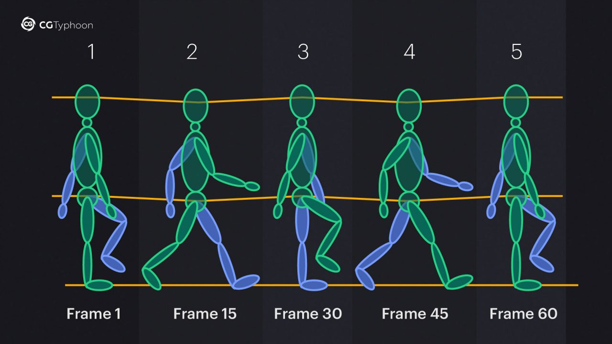

# Factory Visualisation Demo

We can think of the visualisation demo as a means to help give factory workers awareness of what is happening across the factory floor. In other words to provide them with a live situation report (SITREP).

According to the Persimmon Group:

> *The SITREP provides a clear, concise understanding of the situation, focusing on meaning or context in addition to the facts. It does not assume the reader can infer what is important; rather, it deliberately extracts and highlights the critical information. A good SITREP cuts through the noise to deliver exactly what matters: what is happening, what has been done, what will be done next, and what requires attention or decision.*

See: https://thepersimmongroup.com/situation-report-sitrep-template/

The **factory SITREP** should be a dynamic process that combines sensor data with tactical information about what is supposed to be happening, where the current situation departs from the plan and what requires attention. It should cover the past, present and future.

Overhead cameras can be used to monitor what is going on, and the information so derived can be combined with information sent by factory machinery (static and mobile).  This includes barcode and RFID scanners. There may be a degree of uncertainty that calls for checks, e.g. rescanning part numbers and serial numbers as well as the need for quality inspection.

We don’t need to pallet IDs to be scanned from pallets so long as we can track them across the factory floor.  If a camera detects a pallet the system doesn’t know about, the system can issue a new ID for that pallet.  If a forklift approaches the pallet, we may infer it is about to pick it up. Likewise if a forklift separates from a pallet, we can infer it has dropped it off.  Ideally, the forklift will be in touch with the factory system so that we can assign tasks to the forklift, and it can message what it is doing. It would be very strange for factory workers to do everything on their own without communicating with anybody else, and the same applies to factory machinery!

#### Installing and Running the Demo

The files can be found in gitlab: https://gitlab.com/smartedge-project-eu/SMARTEDGE/-/tree/main/artefacts?ref_type=heads:

To run the demo you need to download the `visualise` folder, open a comand line terminal and enter the folder and then run `node demo.mjs` . You can then open the web browser to `http://localhost:8000/`.  This assumes that you have previously installed [Node.js](https://nodejs.org/en). The server makes use of the *url, path, fs, net* and *crypto* npm packages.

Note: you can use a gamepad to zoom and pan the visualisation if you have a wired or wireless one you can connect to your computer. My aim is to be able to scale up to a full model of a factory, and am looking for funding opportunities to realise that ambition. Horizon Europe has some upcoming funding calls that would be relevant. I envisage a combination of LLMs for high level control along with chunks & rules for lower level control, offering much greater flexibility than today's fixed behaviours.

The demo includes a web server that hosts the visualisation as a web page. The server supports unencrypted HTTP and Web Socket connections. It could be extended to support encryption, but that would require the HTTPS security certificate which isn’t so easy to arrange given that browsers not unreasonably object to self-signed certificates.

The file `demo.mjs` initialises the factory and thereafter provides updates to the factory state. This uses an API exposed by `factory.mjs` which in turn is responsible to launching the web server and handling the web socket connections with web pages using JSON messages. You should rewrite `demo.mjs` to interface to factory devices and information systems as appropriate so that the web-based visualisation reflects the dynamic state of the factory.

The demo consists of the following resources:

**server.mjs** a simple HTTP server module that also supports Web Sockets.

**factory.mjs** exposes an API for relaying device information to web pages as well as to control devices with simple sequences of instructions.

**demo.mjs** contains the code for simulating or accessing device information, using the API exposed by `factory.mjs` to initialise and update the visualisation presented in the web page.

**index.html** is the web page for the demo

**visualise.js** is the web page script for the demo

**favicon.ico** is the icon shown in the browser tab

**art/*.png** for the image assets used in the web page

In `demo.mjs` you can add a pallet and a forklift as follows:

```javascript
let pallet1 = new Pallet({
    name:"pallet1",
    x:20,
    y:30,
    orientation:0,
    loaded:true
});
    
let forklift1 = new Forklift({
    name:"forklift1",
    x:10,
    y:30,
    z:0,
    orientation:0,
    speed:1,
    forkspeed:0.5,
});
```

 If you have explicitly updated the forklift's state, you should call `forklift1.sync()` to send the updated state to web pages currently showing the visualisation.  

The demo includes a means to automatically control the behaviour. You can set tasks for forklifts and humans, e.g.

```javascript
forklift1.setTask([
    {act:"wait", time:4},
    {act:"grab", pallet:"pallet1"},
    {act:"move", x:10, y:30},
    {act:"release"},
    {act:"move", x:20, y:30},
    {act:"grab", pallet:"pallet1"},
    {act:"move", x:20, y:30},
    {act:"release"},
    {act:"move", x:10, y:30},
    {act:"next"}
```

For more examples, take a look at the version of `demo.js` provided on GitLab.

Note that the move action prepends a *turn* action to turn to the appropriate orientation. Likewise, the *grab* action prepends *move*, *turn* and *forks* actions as needed, having selected which side of the pallet is the nearest to grab the pallet.  To raise or lower the forks explicitly use the *forks* action, e.g. `{act:"forks", z:0.5}` which raises or lowers the forks to 0.5m above the floor. To turn to a given orientation you can use the *turn* action, e.g. `{act:"turn", orientation:4}`, noting that orientation should be an integer in the range 0 to 7.

Note that the *move* action doesn't include support for avoiding obstacles, whether stationary or moving. I would like to consider that in future work on integrating chunks & rules for more flexible behaviour, and as part of a plan for scaling up to a much larger range of factory devices, e.g. robot arms, conveyor belts, palletization and manfacturing cells.

You can instruct the forklift to wait for a fixed number of seconds, e.g. `{act:"wait", time:4}` waits for 4 seconds.  You can make it a little more interesting by instructing a wait that is randomly selected between an minimum and a maximum time, e.g. `{act:"wait", min:1, max:5}` waits between 1 and 5 seconds.

The *next* action defaults to transferring control to the first action in the task. However, if you provide a list of named steps, a random choice of those steps is made, e.g.

```
...
{act:"move", x:10, y:30, name:"step_a"},
{act:"move", x:20, y:30, name:"step_b"},
{act:"next", steps:["step_a", "step_b"]},  // jump to step a, or step b
```

The information pane is shown when the mouse pointer is moved over a forklift. Having shown the pane, it remains visible until you explicitly move the pointer away. The information shown is the current state of the forklift plus any extra properties defined in the forklift's `extra` property.

The rear factory wall runs along the y axis for x = 0, and includes loading bays.  I have placed open trucks behind the bays.  I have also placed piles of boxes on the factory floor, along with one or more pallets with and without boxes, and a human walking back and forward across the floor. The coordinate system is shown below:


The code in `demo.mjs` is a stub to be replaced by your code using whatever communication protocol you deem convenient for accessing live information on the environment. Each component requires a name that uniquely identifies it in the scene. 

Here is an example of the message the server sends to web pages for the forklift. The *pallet* property is undefined or it is the name of the pallet the forklift either carrying or moving the forks into or out of. The *held* property is only true when the forklift is carrying a pallet.

```
{"name":"forklift1","type":"forklift","x":19.78,"y":30,"z":0,"orientation":0,"speed":1,"pallet":"pallet1","held":false}
```

The properties allow the visualisation to predict the behaviour in the short term until the next update is received. This is akin to how the human mind integrates diverse sources of information with different latencies, and uses this for continual prediction to detect and direct attention to the unexpected.

Users can get information on the forklift by moving the mouse pointer over it, having first click on the window to it the focus. Most of this information is already available to the web page, however the web page also asks the server for any extra information that may apply. In `factory.mjs` you can set this with e.g. `forklift1.extra = {misc: "extra info"}` where the object has one or more properties.

Gamepads are a convenient alternative to using the browser’s keyboard for panning and zooming.  My aim is to work with you on an iterative basis to extend the capabilities as you need.  I will need to limit my time on this due to constraints on my share of the ERCIM time budget for the SmartEdge project.

Scene objects need to be pre-imaged from 45 degree increments facing the origin. The images are combined into tiles for faster loading. The rendering code selects the best image tile for the object's current orientation. The scene is spatially sorted and rendered from back to front. This is done on the basis of the bounding rectangle formed by projecting the object to the ground plane.


Things get a little more complicated when objects overlap, e.g. when a forklift moves its forks into the base of a pallet.  To address this, the pallet's image tiles are split into lower and upper tiles. A similar situation arises when moving pallets into or out of a rack. As a result we have rack tiles for the middle, riser, shelves and upper components that together form the racks.  The art work was created using the Blender 3D editor together with a python script for isometric image capture and a further script to assemble the image tiles.

The rendering model for overlapping objects involves a concept of ownership.  This can also be considered in terms of a hierarchical scene decomposition.  If a forklift is moving its fork into a pallet, the forklift temporarily owns the pallet, and deals with the correct ordering for rendering the visual components.

Special care is needed when viewing objects within a truck that has been backed to an open docking bay.  Here we render the objects offscreen to enable the use of a mask tile that models occlusion by the wall and docking bay, see `art/warehouse/bay-mask.png` which uses yellow to represent non-occluded pixels.

Forklifts have forks that move up and down relative to the body. This is easily modelled by using separate tiles for the forklift body and for the forks.  Robot arms are more complicated as they have many degrees of freedom.  This will be addressed by using offscreen 3D rendering for the arm using WebGL. This allows for smooth movements when composited into the 2.5D scene. I also plan to use 3D models for the humans in the sequence of poses needed for walking. Each pose is specified in terms of the skeleton, as a means to deform the triangular mesh for the skin (the clothes, shoes, hands, head and neck).

### Notes

* **ToDo** - add support for removing objects (from factory, scene and building)
* **ToDo** - generalise the use of the pane for info on all classes of component
* **ToDo** - support moving pallets into and out of the trucks at the loading bays
* **ToDo** - generalise to a much wider set of component classes, e.g. conveyor belts and robot arms
* **Bug Fix** - objects on the floor close to the pair of walls nearest the viewer are not being masked by those walls. I need to check when those walls are being rendered, especially in relation to the Walker.

If the next step is into the wall, the walker reverses direction. In principle, this won't happen if the walker's position, speed and orientation is driven by the building's sensors!  The same is true for walking into obstacles and colliding with forklifts. See later section on integrating chunks & rules.

### Work on replacing the walker sprite

I would like to replace the sprites for the walker with a figure looking like a factory worker with a hard hat. I am looking for a 6 cycle animation for someone walking in 8 compass bearings (N, NE, E, SE, S, SW, W, NW) for the game isometric projection.

I tried Google Gemini. It can create great looking figures (see below), but a) doesn’t understand animation for sprites, and b) has difficulties with ordinals above 4, e.g. as in a 6 cycle walk or in 8 directions. So great for static figures, but no good for people walking.  I couldn't find an easy source of suitable sprites, and this has energised me into learning WebGL so that I can do this using a Web page with a few scripts:

* import or design simple low polygon count models of figures
* add a skeleton and use that to animate the walk cycle using dual quaternions
* image each key frame from the eight camera positions needed for 2.5D rendering
* export the animation to a tiled PNG file

Developing my own solution would also be a step towards creating face models from video frames, and my ambitions for extended reality meetings in the [Immersive Web](https://www.w3.org/2024/06-Raggett-immersive-web.pdf), as well as for modelling robots, given the rich movement of robot arms makes it costly to use PNG tiles for 2.5D rendering.

Blender is hard to use, so I wonder if there is an easier way to design models, e.g. for the worker's hard hat?  One idea is  to fit a 3D model to top and side views. A related idea is to fit a 3D model to a 2D image as a means for compiling texture tiles. I could use Gemini to generate the images, e.g. as below:


My hunch is that I could start with a parameterised model and fit it to the set of images.  The parameters include the joint angles, the length of each component, the cross sectional shapes. In principle, stochastic descent would suffice where we need a computable error. I think this needs segmenting the images into points the outline the different body parts. The fitting process first tries to fit these points, and then to match the textures. I could bootstrap the process by manually identifying key points.

Note that in the above figure, the 3rd image is redundant if we assume left-right symmetry. That wouldn't be the case for someone moving where the symmetry breaks down.

Here is an [example of a 4 stage walk cycle](https://cgtyphoon.com/animation/human-walk-cycle-animation-for-30-fps/). It is in 2D, but could be handy for my work!  I think it exaggerates the swinging motion of the arms. I would also want to have intermediate poses for smoother animation. Note that half of the frames can be formed by mirroring the others.



> Blender is recommended for skinning and animating 3D models. The skeleton is referred to as *rigging* the model.  In my case I could draw the bones in the browser and use the isometric projection to obtain the 3D coordinates relative to the model's origin.
>
> Skinning could be based upon fitting simple cross-sectional polygons as a precursor to adding the triangles.  To skin the joints we need something akin to smooth joints for 2D lines.  I don't need high precision, and fewer parameters would make it simpler fit the images generated with Gemini. My script should provide for left-right symmetry in rigging and skinning.
>
> I should use the game pad as part of the user interface for animating the skeleton. This would allow me to push/pull the joints to the positions needed for each frame, before skinning and sprite image capture.  

I've changed the server-side code to have the ".mjs" file extension so I can define them as modules. This allowed me to use an object orientated approach with classes for Human, Obstacle, Forklift, etc. derived from the Component base class.

Note:  The walker is rendered much larger than a real person.  I need to delve into the details as changing the scale factor used in `drawImage`  shifts the location significantly. A fudge factor should define the size of each sprite's pixels in metres for a zoom factor of 1.

* ***Avoiding sending updates when there are zero changes to apply***

I could save the last message in the component and only send the new one if it is different.

* **For a smoother more scalable visualisation I need to update the web page to predict movements in between updates.**

This will allow for smooth animation when the server sends updates at a lower frequency, as will inevitably happen when the number of components is scaled up significantly. It should use the same algorithm as on the server. 

#### More flexible behaviour

 The current model of tasks assumes that each device has one task composed from a sequence of steps that may be defined to repeat endlessly. What is needed for greater flexibility?

It will be straightforward to integrate the chunks & rules engine as a JavaScript module.  Each step maps to a chunk, e.g. `{act:"move", x:20, y:35` becomes `robot {@do move; x 20; y 35}`.  A task is then a sequence of chunks. 

```
task t1 {} =>
  robot1 {@do turn; orientation:6},
  robot1 {@do wait; min 1; max 2},
  robot1 {@do move; x 10; y 10},
  robot1 {@do move; x 10; y 20},
  robot1 {@do forks; z 0},
  robot1 {@do next; task t1}
```

This assumes that the robot serialises these tasks, so that the chunk buffer is set to `task  t1 {}` when the constituent steps have all completed. Note that the robot actions immediately clear the module's chunk buffer to avoid the task being automatically repeated.

#### How can agents collaborate with other agents?

A single agent could control multiple devices. This can be handled using the chunk type to identify the device, e.g. `robot1` and `robot2`. For a really large system, a single chunk engine would be too slow to control all of the devices. This can be solved by introducing multiple agents executing on different computers, where each agent is responsible for just a few devices. This entails support for agent to agent communication.

Agents can send each other asynchronous messages as chunks. These could be queued to a chunk buffer enabling agents to respond as needed.  Another approach is to use the incoming messages to update the model an agent has of its environment.  The processing can recognise events and queue those as chunks to module buffers for immediate action.

Agents can send arbitrary chunks using `@message` in actions to identify the recipient:

```
start {@message agent4; task t42} # tell agent4 to do task t42
```

Messages can be sent to individual agents or named groups of agents. A further possibility is to deliver messages to subscribers of named topics.

```
# send stop to topic12
stop {@topic topic12}

# recipients need to subscribe to topics, e.g. using
listen {@subscribe topic12}
```

Note that the chunk engine isn't responsible for messaging, which has to be dealt with by the application itself.  I would need to extend the engine to provide the means for applications to handle rule actions involving `@message`, `@subscribe` and `@topic`. The application would need to register handler functions for each of these, as well as managing subscribers and the underlying communication protocols.

I am considering how to allow an agent to delegate tasks to other agents and proceed to a new task when all of those agents have completed their assigned tasks, akin to JavaScript's `Promise.all(promises)`.  The first part is a means to assign a named task to an agent. The second is to initiate an action that injects a chunk when the set of tasks have all completed, e.g. using application defined actions as in:

```
# initiate task3 when tasks 1 to 3 are done
# having delegated these to agents 1 to 3
delegate {} =>
  task1 {@do assign; @agent agent1},
  task2 {@do assign; @agent agent2},
  task3 {@do assign; @agent agent3},
  next {@do done; tasks task1, task2, task2; task4}
```

This could be tidied up by extending the rule engine, e.g.

```
delegate {} =>
  task1 {@assign agent1},
  task2 {@assign agent2},
  task3 {@assign agent3},
  next {@done task1, task2, task3; task4}
```

It is a question of whether it is worth extending the chunks & rules specification rather than relying on the built-in mechanism for registering new actions.  My gut feeling is that `@message`, `@subscribe` and `@topic` are merited for swarm computing, so we may as well add `@assign` and `@done`. 

I may also want to consider further extensions for task/subtask management, in particular for entering and leaving tasks.  I should consider a general means for applications to register action handlers for named terms like `@message`, along with consideration of how to handle conflicts where say an action chunk includes both `@do` and `@message`.  That could be deemed an error!